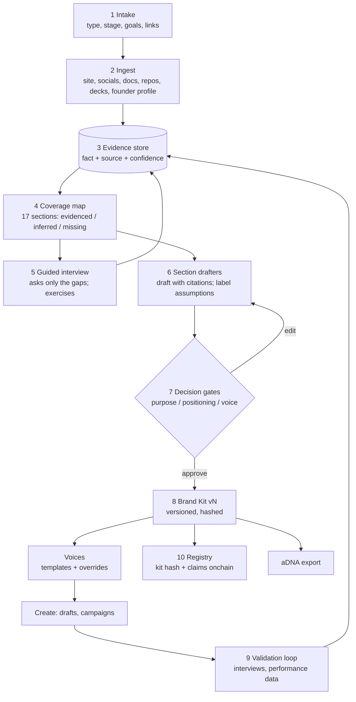
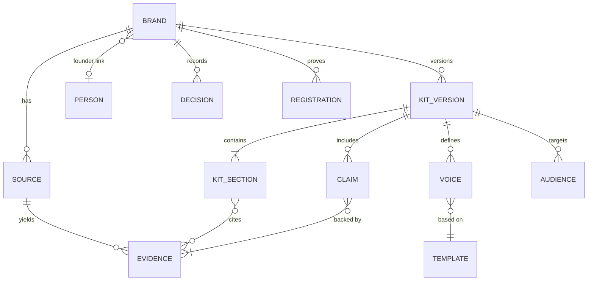

> **Status: accepted.** This is the Brand Builder architecture and input spec. Ratified by Ally Haire in chat, 2026-10-06. It feeds the PRD rewrite (issue #2), and the build follows the phased plan in [issue #4](https://github.com/DeveloperAlly/solana-hack/issues/4).

# Brand Builder: architecture and input spec

**Builds on:** [01 brand pillars](./research/01_brand_pillars.md) (9-step workflow), [02 brand voice elements](./research/02_brand_voice_elements.md) (17-section Brand Kit), [06 voice templates](./research/06_voice_templates.md), [09 demo brands](./research/09_demo_brands.md), [ADR-003](../decisions/adr_003_superhub_business_model.md).

## 1. Design principles
1. **Infer first, then ask only about the gaps.** The product reads what's public, then interviews the owner about what's missing. A brand with no presence is mostly interview. A semi-established brand is mostly confirmation.
2. **Maturity is measured per section, not per brand.** aDNA has a rich written brand but no social presence ([09](./research/09_demo_brands.md)). The builder scores each of the 17 sections separately, so it never asks a question the sources already answer.
3. **Every fact keeps its source.** Every extracted or answered fact is stored as **evidence** with a source: a URL, a document, or "owner answer, date". Drafts cite evidence, and nothing is stated without it. This is the founder's brand-database rule, and it is what gets registered onchain.
4. **The AI drafts and the human decides.** Three **decision gates** (purpose, positioning, voice) must be approved before anything downstream is generated. Inferred personas are labelled as assumptions until real people validate them ([01](./research/01_brand_pillars.md)).
5. **Choose by example, not by adjective.** Voice and tone are picked from sample copy at different slider settings, never from a list of adjectives.
6. **Separate what we say from how we say it.** Strategy (purpose, positioning, messaging) is stored separately from voice (attributes, tone presets, vocabulary). The voice tools reviewed in research 02 merge the two.
7. **The kit is versioned and portable.** Each approved kit version is hashed and exportable as aDNA-structured context. Only approved versions are registered onchain.

## 2. Pipeline



| # | Stage | Input | Output | Agent / owner |
|---|---|---|---|---|
| 1 | Intake | Short form (§5) | Brand profile, type, goals, source list | Owner |
| 2 | Ingest | URLs, uploads, connected accounts | Raw documents | **Ingestor:** fetches, parses, dedupes; respects robots.txt and platform terms; no scraping of private profiles |
| 3 | Evidence store | Raw documents and answers | `Evidence` rows (fact, quote, source, date, confidence) | **Extractor:** maps text to Brand Kit fields |
| 4 | Coverage map | Evidence | A state per section: E / I / M | **Gap analyst:** rules from the input spec (§4) |
| 5 | Guided interview | Gaps only | Owner answers, which become evidence | **Interviewer:** picks the next best question; exercises; skippable |
| 6 | Section drafters | Evidence | Section drafts with citations | **Drafters**, one per section group; **Critic** runs the no-AI-slop pass and consistency checks |
| 7 | Decision gates | Drafts | Approved sections | Owner (human) |
| 8 | Brand Kit | Approved sections | Kit vN plus hash | System |
| 9 | Validation loop | Interviews, post performance | New evidence, suggested kit updates | **Analyst** (later) |
| 10 | Registry | Kit hash, claims, accounts, content | Onchain memos | **Registrar** (deterministic code) |

## 3. Data model



- **Brand:** id, name, type (company / person / product), stage, domain, verified (DNS), parent and founder links.
- **Person:** a founder or person profile with its own kit. It shares the story bank with a linked company.
- **Source:** url or upload, kind (site, doc, social, repo, deck, profile, interview), fetched_at, owner_supplied.
- **Evidence:** fact, verbatim quote (short), source_id, section, confidence (high / med / low), status (evidenced / inferred / answered / rejected).
- **Kit version / Kit section:** section key (one of the 17), content JSON, state (E / I / M), approved_by, approved_at, hash.
- **Claim:** text, evidence ids, owner, expiry, status (approved / pending / expired), registered_tx.
- **Voice:** template id plus overrides (9 dimensions, per-channel), example outputs, approved.
- **Audience:** segment, jobs, pains, gains, channels, expertise, validation status (proto / validated).
- **Decision:** gate, choice, rationale, by, at. It mirrors an ADR.
- **Registration:** type (identity / account / content / claim / kit / persona), hash, tx signature, at.

## 4. Input spec (per Brand Kit section)

Key: **Req** = needed before kit v1 · **Infer from** = where the builder looks first · **Ask** = the question when not evidenced · **Ex** = exercise · **min** = owner time · **Zero-data fallback** = what happens when nothing is public · **Gate** = needs explicit approval.

| # | Section | Req | Infer from | Ask (only if missing) | Ex | min | Zero-data fallback | Gate |
|---|---|---|---|---|---|---|---|---|
| 1 | Identity | Yes | Domain, site title, socials, org pages | Name, type (company / person / founder-linked), one-line description | Form | 1 | Ask | |
| 2 | Purpose | Yes | About / mission pages, founder talks, README | "Why does this exist? What was broken?" "What will it do in 5/10/20 years?" | Golden Circle prompts (What / How / Why) | 3 | Draft from origin-story answers | **Purpose** |
| 3 | Beliefs / POV | Yes | Long-form posts, manifestos, changelogs | "What do you believe that most of your category doesn't?" "What are you against?" | This-not-that pairs | 2 | Draft from purpose plus competitors | |
| 4 | Values | Yes | Values pages, hiring pages | Pick and rank 3 values from cards; "what cost would you accept for each?" | Value card sort | 2 | Ask | |
| 5 | Positioning | Yes | Site hero, comparison pages, competitor sites (public) | "What would people use if you didn't exist?" "What can you do that they can't?" | Dunford sequence; 2x2 | 3 | AI researches competitors and drafts options | **Positioning** |
| 6 | Value props | Yes | Feature and benefit copy, pricing pages | Confirm or edit the drafted jobs, pains and gains per segment | Value Proposition Canvas (prefilled) | 2 | Draft from positioning | |
| 7 | Audience | Yes | Site copy, community pages, follower bios (aggregate only) | "Whose opinion do you care about?" Name 1–3 real customers or fans | Persona cards | 2 | Proto personas, **labelled as assumptions** | |
| 8 | Messaging | Yes | Taglines, headings, repeated phrases | Rank the drafted pillars; mark must-keep phrases | Card sort: is / aspires to be / is not | 2 | Draft from 2–7 | |
| 9 | Voice attributes | Yes | Corpus profiling (needs 300–500+ words per research 02) | Choose between sample paragraphs written at different settings | Pick by example | 2 | Samples generated from the archetype plus sliders | **Voice** |
| 10 | Tone presets | Yes | Per-channel corpus (if any) | Set presets per channel and context, starting from templates (research 06) | Sliders on 9 dimensions | 2 | Template defaults | (in Voice gate) |
| 11 | Vocabulary | No | Term frequency in sources; product names | Confirm approved and banned terms | List edit | 1 | Seed from positioning plus category | |
| 12 | Claims | Yes (for proof layer) | Numbers and superlatives in sources | Attach evidence or downgrade each claim | Claim table | 2 | Only claims with owner-supplied evidence | |
| 13 | Visual kit | No | Logo files, CSS colours and fonts, OG images | Upload logo, pick colours and type | Upload / pick | 2 | Placeholder, or hand off to a design tool | |
| 14 | Audio kit | No | Media files | Sonic logo or voice persona (optional) | Upload | 0 | Skip | |
| 15 | Behaviour | No | Support pages, changelog tone | How to apologise, celebrate, handle conflict | Short scenarios | 1 | Template defaults | |
| 16 | Examples | No | Existing posts | Mark on-brand and off-brand examples | Thumbs up / down | 1 | Generated examples (labelled) | |
| 17 | Governance | Yes | n/a | Owner, approvers, review cadence | Form | 1 | Owner = creator | |

**Totals:** all sections from zero comes to about **30 minutes** of owner time. With the minimum viable intake below, about **15 minutes** gets kit v1.

## 5. Minimum viable intake (zero-presence brand, ~15 min)
This is the shortest path to a usable kit v1. Everything else starts as a labelled draft and is refined later.
1. **Form (2 min):** name, type, one-line description, links (if any), 12-month goal, primary channel.
2. **Origin (3 min, voice or text):** why it exists; what was broken; first win or proof point.
3. **Golden Circle (2 min):** what / how / why. The AI drafts purpose for **Gate 1**.
4. **Alternatives and edge (3 min):** what people use instead; what only you can do. The AI researches competitors and drafts 3 positioning options for **Gate 2**.
5. **Audience (2 min):** whose opinion matters, and 1–3 real people if any. The AI drafts proto personas.
6. **Voice by example (3 min):** pick 1 of 3 paragraphs, twice; adjust 3 sliders. Then **Gate 3**.

Beliefs, values, messaging and vocabulary are then drafted from these answers and shown for quick edits. Claims start empty until evidence is attached.

## 6. Voices and polish
- **Voices** are a template (research 06) plus per-channel overrides on 9 dimensions. Claims strictness works as a gate, not a slider. A kit can hold several voices, e.g. Founder / Candid and Brand / Professional.
- **Draft pipeline:** brief → draft in the chosen voice → no-AI-slop pass → voice-fit score + platform score (research 03) → **polish actions** → human approval → schedule or post → optional registration.
- **Polish actions** (on any draft, single click, always reversible):
  - **Review:** flags clarity, factual claims without evidence, off-voice phrases, and platform issues. LinkedIn's own composer offers Review, Shorten and Clarify, and its Post Proofreader (Premium, Aug 2026) suggests inline fixes ([SocialPilot](https://www.socialpilot.co/blog/new-linkedin-features-and-updates)).
  - **Shorten:** to platform norms or a target length.
  - **Clarify:** simplifies sentences and jargon to the voice's targets.
  - **Beautify (new):** structure for scanning.
    - Turns lists into bullets (e.g. "•").
    - Adds a hook line and spacing between blocks.
    - Promotes key phrases.
    - Applies per-platform formatting: markdown for Substack and blogs, plain text with line breaks for LinkedIn and X.
    - LinkedIn has **no native bold**, so emphasis needs Unicode "mathematical" characters. Screen readers may read these letter by letter, so Beautify limits Unicode emphasis to a few key phrases and offers an **accessible mode** that uses no Unicode styling ([linkedinpreview](https://linkedinpreview.com/blog/linkedin-unicode-formatting-guide)).

## 7. Proof layer (what gets registered, when)
| Event | Registered | Why |
|---|---|---|
| Brand verified (DNS) | Identity memo: brand id, domain, owner wallet | Proves who controls the brand |
| Kit v1 approved | Kit hash and version | Makes "this is our official voice and positioning" checkable |
| Claim approved | Claim hash plus evidence hashes and expiry | Claims with evidence |
| Official account linked | Account handle hash | "Is this account official?" |
| Post approved and published | Content hash, kit version, approver | Verify page and badge |
| AI persona created | Persona id, disclosure flag, kit link | Labelled, attested AI influencer |

Only hashes and ids go onchain. Content stays offchain.

## 8. aDNA export
The Brand Kit exports as an aDNA-structured folder:
- `what/brand/` holds one file per section, with frontmatter and status.
- `what/decisions/` holds the three gate decisions as ADRs.
- `what/context/sources.md` is the evidence index.
- `how/templates/` holds the voices.

Any agent can then load the brand as context. This dogfoods aDNA, which is a demo brand.

## 9. Worked cases ([09](./research/09_demo_brands.md))
| Brand | Profile | What the builder ingests | What it asks |
|---|---|---|---|
| **Waterlily** (headline, built live) | Zero for the new brand; thin 2023 legacy (press, docs; the site is dead) | 2023 legacy as **E(legacy)**, which must be confirmed or rejected | Almost everything: the full minimum viable intake, all three gates |
| **aDNA** | Strong written brand (site, spec, changelog); **no social presence** | Purpose, beliefs, value props, audience, messaging, vocabulary, claims, palette cues | Values, tone presets, visual files, governance; social channel strategy |
| **film.fun** | Semi-established: product, site, education hub, 5 social networks linked | Identity, purpose, positioning, value props, audience, messaging, claims, examples | Values, tone presets, audio, behaviour, governance, visual files |
| **GamersLab** ([gamerslab.gg](https://www.gamerslab.gg/), confirmed) | Thin public presence (site, app, GitHub org, one long-form post) **plus an owner-supplied product brief**. Its positioning has shifted from an onchain event ledger to AI analytics | The site, the app copy, the Medium post, **and the existing product brief and case studies, uploaded as owner-supplied sources** | Positioning (to settle the shift), values, tone presets, visual files, governance |

Tone presets, the audio kit and governance must be asked for **every** brand. Visual kits exist publicly only as logo or hero descriptions.

## 10. Hackathon cut for the builder
- **Build:**
  - intake
  - ingest of URLs and uploads (sites, docs, READMEs)
  - evidence store
  - coverage map
  - interview for the minimum viable intake
  - drafters
  - 3 gates
  - kit v1 plus hash registration
  - voices from templates
  - Review / Shorten / Clarify / Beautify
- **Thin:** claims with evidence (manual evidence links); aDNA export (download).
- **Coming soon:** connected social accounts ingest, validation loop, audio kit, behaviour scenarios.

## 11. Open questions
- **Ingest limits:** X, Instagram and TikTok pages can't be fetched without official API access. For the hackathon, ingest owned sites, docs and uploads; social history is coming soon.
- **Calibration:** calibrate template values and the voice-fit score (research 06).
- **Ratify §12.3 and step 2a in §12.1** (proposed 2026-10-06): the coverage cut-off, section dependencies and stale redrafts, drafter and writer inputs, canonical JSON hashing, and founder-profile ingest with a perception audit.
- **Resolved 2026-10-06, GamersLab:** confirmed as gamerslab.gg. The founder's lead finder already holds an owner-supplied product brief and case studies for it. That makes a good demo of the upload path, and it closes the loop with **Find your customer**.

## 12. End-to-end walkthrough: user flow and pipeline
This ties §2–§7 together. Lines tagged **[proposed]** fill gaps the spec leaves open. They wait for owner ratification. Everything else restates decided spec.

### 12.1 User flow
Example: a founder setting up a company brand. Differences between a brand with no public presence (Waterlily) and an established one (film.fun) are noted where they apply.

| # | Step | What's asked or done | Required? | Status |
|---|---|---|---|---|
| 0 | Sign in | Email and a 6-digit code. An embedded wallet (Phantom Connect) is created; no seed phrase, no extension | Yes | Hackathon |
| 1 | Basics (~2 min) | Name; type (company / person / founder-linked); one-line description; 12-month goal; primary channel; links | Yes, links optional | Hackathon |
| 2 | Sources | Owned site, docs, blog and README URLs; uploads (deck, brief, guidelines, case studies); domain check by DNS TXT record (optional in the PoC, unverified brands are flagged); connected social history | Optional; skipping goes straight to the interview | URLs and uploads: hackathon. Social history: coming soon (needs official API access) |
| 2a | Founder profile | CV or LinkedIn export for person and founder-linked brands, plus how others see them (Avery & Greenwald's perception audit, [01](./research/01_brand_pillars.md) §2) | Optional | **[proposed]**: closes a gap in §4 and §5 |
| 3 | Reading sources | Each source shows progress; Retry or Skip on failure; safe to leave, email when done | n/a | Hackathon |
| 4 | Coverage map | All 17 sections shown as Evidenced / Inferred / Missing: "here's what we found, here are the N questions left". film.fun: mostly E and I. Waterlily: almost all M | n/a | Hackathon |
| 5 | Interview (only the gaps) | The §5 steps 2–6: origin; what/how/why then **Gate 1 Purpose**; alternatives and edge, 3 positioning options, then **Gate 2 Positioning**; audience with personas labelled as assumptions; voice by example, then **Gate 3 Voice**. Where a source already answers a question, the step becomes "confirm this", with the source cited. Every question can be skipped and resumed | Gates required | Hackathon |
| 6 | Quick review | Beliefs, values (card sort), messaging pillars and vocabulary are drafted for quick edits. Claims start empty until evidence is attached. Visuals, behaviour, examples and audio can wait | No | Hackathon (claims thin) |
| 7 | Approve kit v1 | The kit locks as v1; its hash is registered on Solana devnet with an explorer link; the aDNA export unlocks | Yes | Hackathon |
| 8 | Voices | Templates (12 templates on 9 dimensions, [06](./research/06_voice_templates.md)) with per-channel overrides; claims strictness as a gate | Yes, at least one | Hackathon |
| 9 | First post | Brief → draft → no-AI-slop pass → voice-fit and platform scores → polish (Review / Shorten / Clarify / Beautify) → approve → publish (connected X or LinkedIn, or copy and paste the URL back) → content hash registered → checkable on the Verify page | n/a | Hackathon |

After that, all optional: claims with evidence, an ambassador campaign with USDC payouts, quests (coming soon), inbox and engagement.

### 12.2 How each user action runs through the pipeline
**The core idea:** one evidence store holds everything the system knows. Every fact keeps its source. The interview, the drafters and the coverage map all read from and write to that store. The kit is compiled only from approved sections.

| User action | Stage and agent | Writes |
|---|---|---|
| Fills in Basics | Intake | `Brand`; each answer stored as `Evidence` with source "owner answer, date" |
| Adds URLs or uploads | **Ingestor:** fetch, parse, dedupe; respects robots.txt and platform terms | `Source` (uploads marked `owner_supplied`) |
| (automatic) | **Extractor:** maps text to kit sections | `Evidence`: fact, short quote, source, section, confidence |
| (automatic) | **Gap analyst** | E / I / M per section, which drives the coverage map |
| Answers a question | **Interviewer:** picks the next best question from the gaps | `Evidence` (status: answered) |
| Reaches a gate | **Section drafters** + **Critic** (no-AI-slop pass, consistency check, citation check) | Drafts that cite evidence ids |
| Approves a gate | Gate | `Decision` (mirrors an ADR); the section locks |
| Approves the kit | Kit compiler + **Registrar** (deterministic code, no AI) | `KitVersion` + hash → Solana memo → `Registration` |
| Creates a voice | Voice compiler | `Voice` = template + overrides, compiled into a plain-language rule set for the writer |
| Writes a post | Drafter → Critic → scorers → polish | Draft, scores, approval; content hash → `Registration` |

### 12.3 Pipeline rules [proposed]
1. **Coverage cut-off.** A section is **E** if it has at least one high-confidence fact from an owned source, or a direct owner answer. It is **I** if it has only medium or low confidence facts, or derived ones. It is **M** if it has nothing.
2. **Section dependencies.** Following §1 principle 4, nothing past a gate is generated until the gate is approved:
   ```
   Identity ─┬─> Purpose [Gate 1] ──> Beliefs, Values ──────────────┐
             ├─> Audience ─────────┐                                ├─> Messaging ─> Examples
             └─> Alternatives ─────┴─> Positioning [Gate 2] ─> Value props, Claims ┘
   Audience + Positioning ─> Voice [Gate 3] ─> Tone presets, Vocabulary
   ```
   The interviewer asks the required sections in this order. If an approved gate is edited, every section downstream of it is flagged **stale** and redrafted. Nothing is overwritten silently.
3. **Drafter inputs.** Each drafter gets the section's evidence, the approved sections it depends on, and the section rules from §4. It returns text that cites evidence ids. Anything it can't cite is labelled "assumption".
4. **Kit compilation.** Approved sections go into canonical JSON with sorted keys, which is hashed with SHA-256. Only the hash and ids go onchain. A new version gets a new hash, and existing posts keep the version they were made with.
5. **Writer inputs for each post:**
   - approved positioning, messaging and vocabulary
   - the voice rule set
   - the **claims allow-list** (only approved claims may state numbers)
   - platform rules ([03](./research/03_platform_performance.md))
   - the brief

   The Critic checks the draft against the same inputs. Claims that aren't on the list are blocked, and terms on the avoid list are flagged.
6. **Validation loop (coming soon).** Post performance and real customer interviews become new evidence. That evidence produces suggested kit updates, which go back through the gates.

### 12.4 Infrastructure (open; settled in P0 and P1 of [issue #4](https://github.com/DeveloperAlly/solana-hack/issues/4))
- **LLM gateway:** an OpenRouter free model by default, plus bring your own Claude or OpenAI key. Every call logs its prompt version.
- **Storage:** Supabase for the evidence, kit and voice tables.
- **Runtime:** ingest and agent runs probably on Cloudflare Queues or Workflows. The Workers free plan allows 10 ms of CPU per request, but time spent waiting on LLM calls doesn't count toward it. Still to be verified.
